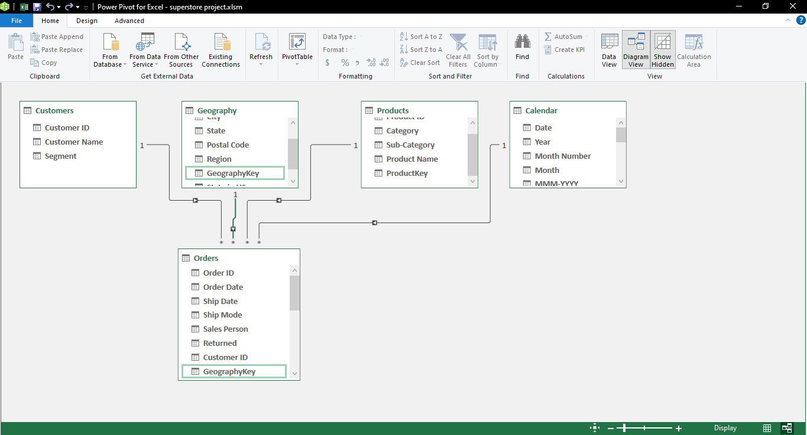

# Superstore Performance Dashboard

## Introduction
This is a Microsoft Excel project on the popular superstore dataset, which is a fictional store that sells three different categories of product: Furniture, Office Supplies and Technology. The goal of the project is to gain insights into the stores' performance based on revenue generated and profit made over time.

## Problem statement
To identify:
- How sales and profit trended on quarterly and yearly basis.
- How sales and profit trended by region and state.
- Which sales person generated the highest revenue and profit.
- Which product subcategory was profitable and which was unprofitable.

## Skills demonstrated
The following Microsoft Excel skills were incorporated into this project:
- Data transformation using Power Query Editor.
- Data modelling using Power Pivot.
- Building Pivot Tables and Pivot Charts.
- Connecting Slicers with reports.
- Recording and assigning macros for interactivity.

## Data sourcing
The Superstore dataset is ubiquitous, however the one used here was obtained from [Data.World](https://data.world/missdataviz/superstore-2021).

## Data transformation
The dataset was transformed using the Power Query Editor feature on Microsoft Excel. Multiple sheets in the dataset were first merged together and one duplicate row was found and removed after redundant columns were expunged. The merged dataset was divided into four distinct tables and proper relationships were established between these tables through keys.

## Data modelling
The model is a star schema. There are three (3) dimension tables named Products, Geography and Customers and one (1) fact table named Orders. The dimension tables are all joined to the fact table in a one-to-many relationship. Additionally, a Calendar table (dimension table) was created in the Power Pivot window.

